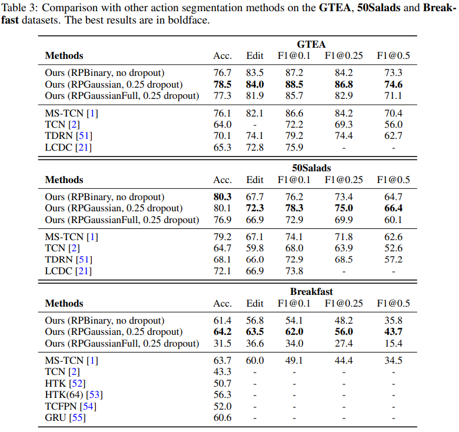

# Frontal Low-rank Random Tensors for Fine-grained Action Segmentation


## License & Citation
Our code follows the MIT [license](LICENSE). When using our code, please cite our work
```
@article{zhang2019frontal,
  title={Frontal Low-rank Random Tensors for Fine-grained Action Segmentation},
  author={Zhang, Yan and Muandet, Krikamol and Ma, Qianli and Neumann, Heiko and Tang, Siyu},
  journal={arXiv preprint arXiv:1906.01004},
  year={2019}
}
```

One can read our manuscript [here](https://arxiv.org/abs/1906.01004).




___
## Code Description

### Training
To train from scratch, one can run

    sh script_run_trainval.sh $dataset $pooling $dropout $epoch
    
For example, to train models on the **50Salads** dataset with **RPGaussian** method and **0.5 dropout ratio** for **50 epochs**. One should run in the terminal

    sh script_run_trainval.sh 50salads RPGaussian 0.5 50

One notes that the ```dropout``` argument only works for higher order information pooling. When using **FirstOrder** pooling, which is exactly the original paper of MS-TCN, ```dropout``` is actually not used. For example, when train the original MS-TCN model, one can run

    sh script_run_trainval.sh 50salads FirstOrder 0.5 50
in which the dropout ratio does not apply.
 

### Evaluation
After training, the checkpoints are stored in the __models__ folder. Alternatively, one can download our checkpoints, and save them into the __models__ folder. To test, one can for example run

    sh script_run_val.sh breakfast RPGaussian 0.25 50
    

Then, one will see the evaluation for individual splits and their average, such as 

      ---------------final results -------------------
        Acc: 67.4949
        Edit: 65.4094
        F1@0.10: 65.2132
        F1@0.25: 60.6105
        F1@0.50: 48.5950
        Acc: 63.6333
        Edit: 64.1772
        F1@0.10: 62.1445
        F1@0.25: 56.9267
        F1@0.50: 44.8474
        Acc: 62.0086
        Edit: 62.9669
        F1@0.10: 59.1581
        F1@0.25: 52.1470
        F1@0.50: 39.3073
        Acc: 63.5422
        Edit: 61.5132
        F1@0.10: 61.4730
        F1@0.25: 54.4051
        F1@0.50: 42.0313
        ------- overall ----------
        Acc:64.169759
        Edit:63.516686
        F1@10:61.997198
        F1@25:56.022301
        F1@50:43.695239


___
## Data and Models

### Data
Please put these folders of frame-wise features in to the __data__ folder.

[download](https://github.com/yabufarha/ms-tcn)


### checkpoints
Please put these checkpoints folders in to the __models__ folder, for reproducing the results in our manuscript.

[download](https://drive.google.com/file/d/1SX4nQOA9kvUHjfalAxjF_u5e2Ruy_2m0/view?usp=sharing)


___
## Acknowledgement
Our code is developped based on the following work, the github repo of which is [here](https://github.com/yabufarha/ms-tcn).

    @inproceedings{farha2019ms,
      title={Ms-tcn: Multi-stage temporal convolutional network for action segmentation},
      author={Farha, Yazan Abu and Gall, Jurgen},
      booktitle={Proceedings of the IEEE Conference on Computer Vision and Pattern Recognition},
      pages={3575--3584},
      year={2019}
    }
